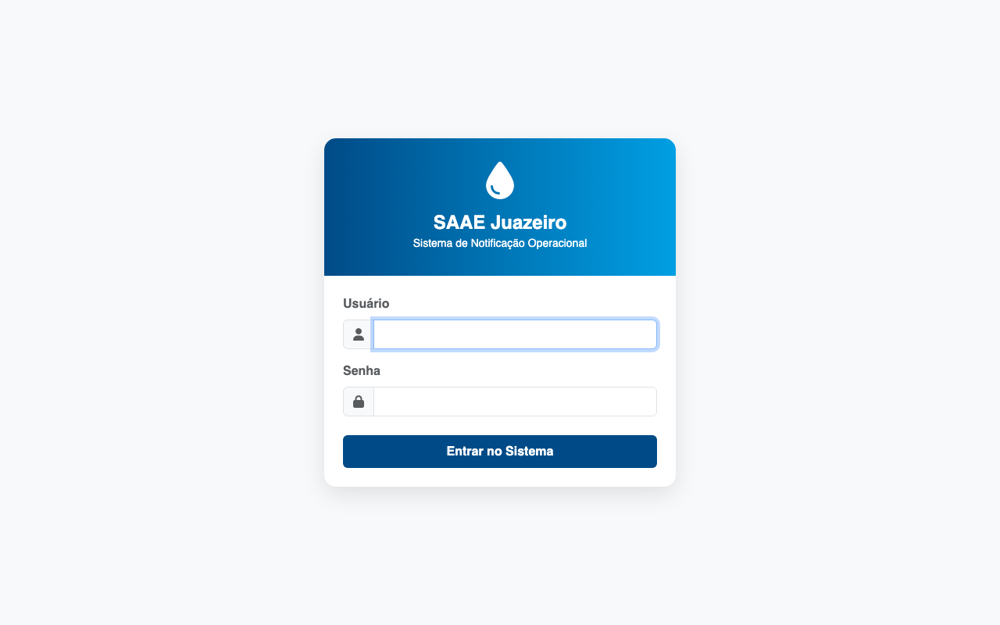
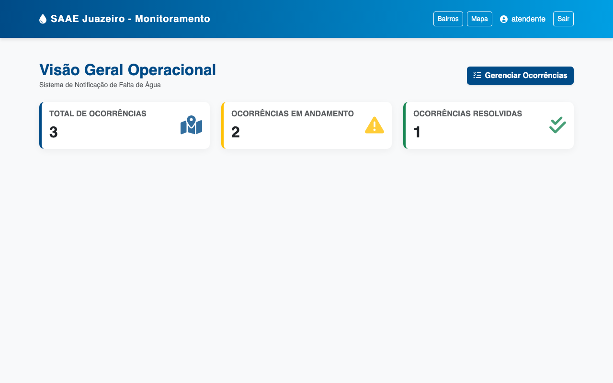
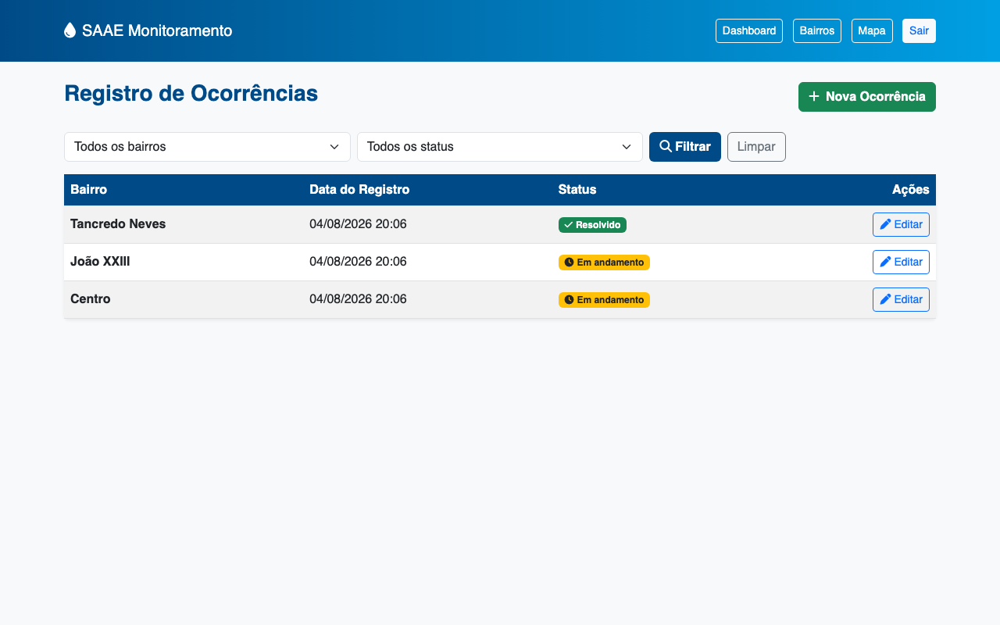
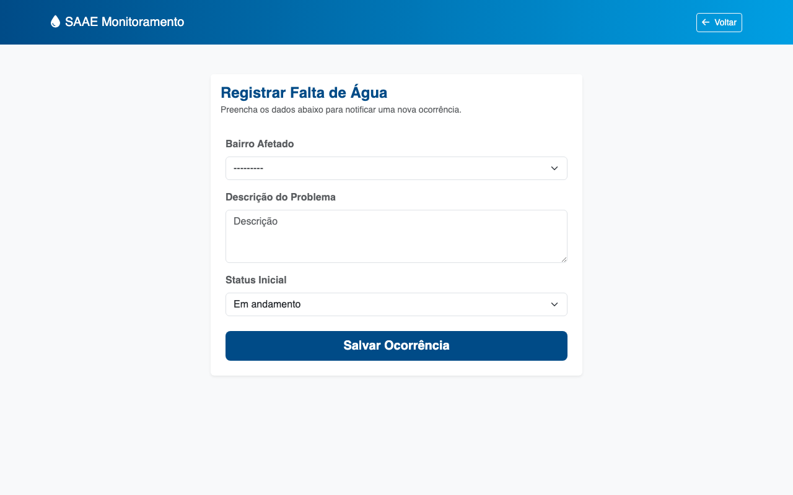
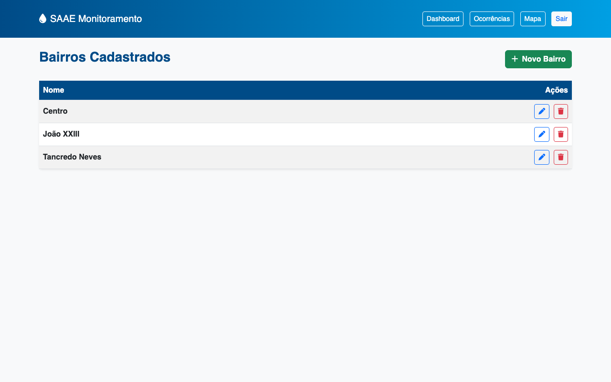
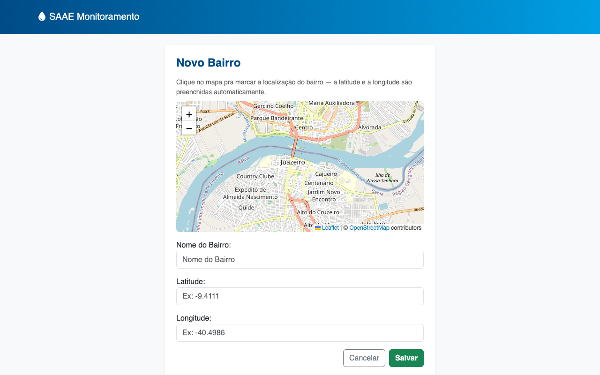
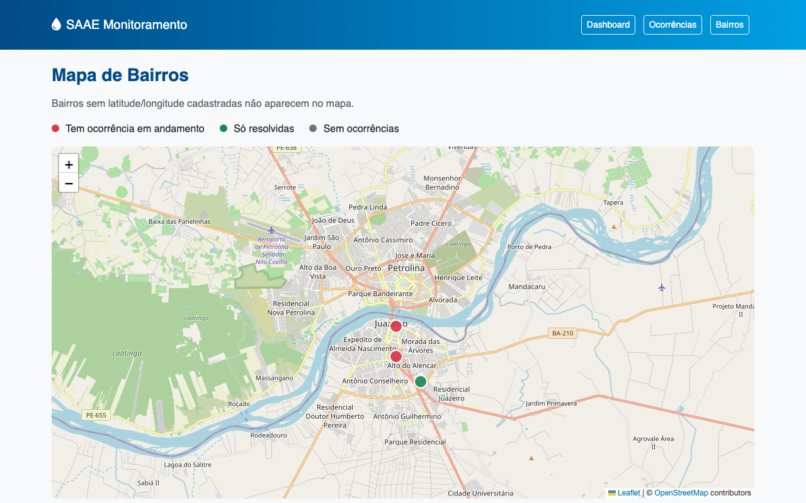

# Sistema de Notificação de Falta de Água por Bairro

Esse é um sistema web pra registrar e consultar ocorrências de falta de água, feito pro SAAE Juazeiro. Dá pra cadastrar bairros, registrar ocorrências ligadas a um bairro, acompanhar se cada uma está em andamento ou resolvida, ver um dashboard com os números gerais e localizar tudo num mapa.

## O que precisa ter instalado

- Python 3.13 ou mais novo
- pip
- Docker e Docker Compose (só se quiser rodar via container, é opcional)

## Como rodar

### Com ambiente virtual (venv)

```
python3 -m venv venv
source venv/bin/activate
pip install -r requirements.txt
python manage.py migrate
python manage.py createsuperuser
python manage.py runserver
```

Depois disso, é só abrir `http://localhost:8000`. Não tem usuário pré-cadastrado — quem cria a conta de acesso é o comando `createsuperuser`.

### Criando sua conta de acesso

Quando você roda `python manage.py createsuperuser`, ele vai perguntar, nessa ordem:

```
Username: admin
Email address: admin@example.com
Password:
Password (again):
```

Pode deixar o e-mail em branco e só apertar Enter. A senha não aparece enquanto você digita, mas está sendo registrada normalmente, sem problema. Com essa conta você entra em dois lugares:

- `http://localhost:8000/login/` — a tela de login do sistema, pra usar o dashboard, cadastrar bairro, ocorrência e ver o mapa.
- `http://localhost:8000/admin/` — o painel administrativo que já vem pronto no Django, com acesso direto aos dados do banco.

Não precisa criar duas contas, a mesma serve pros dois.

### Com Docker

```
docker compose up --build
```

O container já roda as migrations sozinho quando sobe. Pra criar a conta de acesso, com o container rodando, abre outro terminal e roda:

```
docker compose exec web python manage.py createsuperuser
```

Também fica disponível em `http://localhost:8000`.

## Rodando os testes

```
python manage.py test
```

Os testes usam um banco temporário, que o Django cria e apaga sozinho toda vez que você roda o comando. Não mexe no seu banco de verdade.

## Como usar

1. Entra em `http://localhost:8000` e faz login com a conta que você criou.
2. No menu, vai em **Bairros** e cadastra pelo menos um. No formulário dá pra digitar o nome e escolher uma sugestão de bairro real de Juazeiro-BA (a latitude e a longitude já vêm preenchidas sozinhas), ou então clicar direto no mapa pra marcar onde é.
3. Vai em **Ocorrências → Nova Ocorrência** e registra, informando o bairro, a descrição do problema e o status inicial. O responsável é preenchido sozinho com quem está logado.
4. Na listagem, dá pra filtrar por bairro e por status, ou clicar em **Editar** pra mudar o status de uma ocorrência (por exemplo, marcar como resolvida depois do reparo).
5. O **Dashboard** mostra o total de ocorrências, quantas estão em andamento e quantas foram resolvidas — e se atualiza sozinho a cada dez segundos: se surgir uma ocorrência nova em andamento enquanto a página está aberta, aparece um aviso na tela.
6. O **Mapa** mostra os bairros que têm coordenada cadastrada, cada um com uma cor: vermelho se tem ocorrência em andamento, verde se só tem resolvida, cinza se não tem nenhuma.
7. Dá pra mexer nos mesmos dados por API também, em `/api/bairros/` e `/api/ocorrencias/` (aceita `?bairro=<id>` e `?status=<status>` pra filtrar).

## O que o sistema faz

- Login obrigatório em todas as páginas
- Cadastro de bairro (criar, listar, editar, excluir), com mapa clicável e sugestão de nomes reais de Juazeiro-BA pra facilitar
- Cadastro de ocorrência (bairro, data/hora, descrição, status, responsável), com edição de status
- Listagem de ocorrências com filtro por bairro e status
- Dashboard com total, em andamento e resolvidas
- Aviso em tempo real quando surge uma ocorrência nova
- Mapa com os bairros, colorido conforme a situação
- API REST (`/api/bairros/` e `/api/ocorrencias/`), usando o mesmo login do site

## Capturas de tela

**Login**



**Dashboard**



**Listagem de ocorrências**



**Nova ocorrência**



**Listagem de bairros**



**Novo bairro, com mapa clicável**



**Mapa de bairros**



## Como o projeto está organizado

```
setup/          configuração geral do Django (settings, rotas principais)
ocorrencias/    o app em si: models, views, forms, API REST, templates e testes
```

## Tecnologias usadas

- Python / Django
- Django REST Framework
- Bootstrap 5
- Leaflet (mapa, com dados do OpenStreetMap)
- SQLite
- Docker
